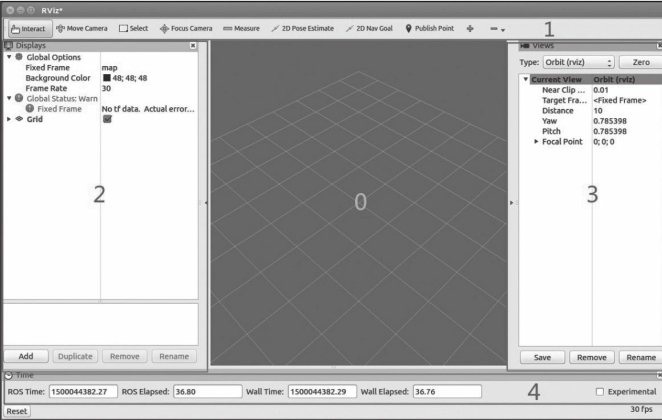

# Ros-Learning（WSL2+Ubuntu20.04）


##  1.准备工作（Preparation）

###### Books

[Books/Ros Leanring at main · felix-lhz/Books (github.com)](https://github.com/felix-lhz/Books/tree/main/Ros Leanring)

### 1.1 基本系统组件安装（Basic System Component Installation）

###### WSL2+Ubuntu

[windows11 安装WSL2全流程_win11安装wsl2-CSDN博客](https://blog.csdn.net/u011119817/article/details/130745551)

###### cuda11.8+cudnn8.8

[WSL2+ubuntu2004+cuda11.8+cudnn8.8开发环境搭建_wsl安装cudnn-CSDN博客](https://blog.csdn.net/pipupip/article/details/131405555)

###### Linux GUI

[使用 WSL 运行 Linux GUI 应用 | Microsoft Learn](https://learn.microsoft.com/zh-cn/windows/wsl/tutorials/gui-apps)

###### pytorch安装

[使用 WSL 运行 Linux GUI 应用 | Microsoft Learn](https://learn.microsoft.com/zh-cn/windows/wsl/tutorials/gui-apps)

###### miniconda安装

[Miniconda — Anaconda documentation](https://docs.anaconda.com/miniconda/)


### 1.2 工作空间（WorkSpace）

#### 1.2.1 工作空间配置（workspace config）

```创建WorkSpace
mkdir ~/p ~/ros-learning/src
cd ~/ros-learning/src
catkin_init_workspace
```

```catkin_make
cd ~/ros-learning
catkin_make
```

##### 1.2.1.1 catkin_make Errors

```catkin_make error  1
-- Could NOT find PY_em (missing: PY_EM) 
CMake Error at cmake/empy.cmake:30 (message):
Unable to find either executable 'empy' or Python module 'em'...  try
installing the package 'python-empy'
```

``` catkin_make error 2
ImportError: "from catkin_pkg.package import parse_package" failed: No module named 'catkin_pkg'
Make sure that you have installed "catkin_pkg", it is up to date and on the PYTHONPATH
```

[Ubuntu20.04安装Ros Noetic版本，在catkin_make编译时出现的问题_unable to find either executable 'empy' or python -CSDN博客](https://blog.csdn.net/qq_39437730/article/details/118272390#:~:text=-- Could N)

##### 1.2.1.2 locate error

WSL2安装locate命令一直显示Initializing mlocate database; this may take some time，进度一直卡在60%。

[WSL2安装locate命令一直显示Initializing mlocate database； this may take some time，进度一直卡在60%_initializing plocate database; this may take some -CSDN博客](https://blog.csdn.net/qq_15969343/article/details/129189584#:~:text=再次运行sudo a)

##### 1.2.1.3 环境变量配置

```source
echo "source ~/ros-learning/devel/setup.bash">>~/.bashrc
```

#### 1.2.2 功能包配置（package config）

``` create packages
cd ~/ros-learning/src
catkin_create_pkg learning_communication std_msgs rospy roscpp
cd ..
catkin_make
```

### 1.3 Vscode+ROS配置

[【ROS】VSCODE + ROS 配置方法（保姆级教程，总结了多篇）_vscode ros-CSDN博客](https://blog.csdn.net/g944468183/article/details/123759886#:~:text=使用VScode搭建)

## 2.ROS基础（ROS Basics）

### 2.1 话题中的Publisher与Subscriber（Publisher And Subscriber In Topic）

#### 2.1.1 创建Publisher（Create Publisher）

[talker.cpp](./src/learning_communication/src/talker.cpp)

#### 2.1.2 创建Subscriber（Create Subscriber）

[listener.cpp](./src/learning_communication/src/listener.cpp)

#### 2.1.3 CMakeList.txt

``` CMakeList.txt
include_directories(include ${catkin_INCLUDE_DIRS})

add_executable(talker_node src/talker.cpp)
add_executable(listener_node src/listener.cpp)

add_dependencies(talker_node ${${PROJECT_NAME}_EXPORTED_TARGETS} ${catkin_EXPORTED_TARGETS})
add_dependencies(listener_node ${${PROJECT_NAME}_EXPORTED_TARGETS} ${catkin_EXPORTED_TARGETS})

target_link_libraries(talker_node
  ${catkin_LIBRARIES}
)
target_link_libraries(listener_node
  ${catkin_LIBRARIES}
)
```

#### 2.1.4 运行Publisher和Subscriber

```Run
catkin_make
roscore
rosrun learning_communication talker_node
rosrun learning_communication listener_node
```

#### 2.1.5 自定义消息包（msg）

[Person.msg](./src/learning_communication/msg/Person.msg)

###### 编译消息包（build msg）

```package.xml
<build_depend>message_generation</build_depend>
<exec_depend>message_runtime</exec_depend>
```

```CMakeList.txt
find_package(catkin REQUIRED COMPONENTS
  ......
  message_generation
)
catkin_package(
......
 CATKIN_DEPENDS geometry_msgs roscpp rospy std_msgs message_runtime
......
)
add_message_files(
  FILES
  Person.msg
)
generate_messages(
  DEPENDENCIES
  std_msgs
)
```

###### 查看消息包（check msg）

```terminal
rosmsg show Person
```

### 2.2 服务中的Server和Client（Server and Client in Service）

#### 2.2.1 定义服务数据（Defining Service Data）

[addTwoInts.srv](./src/learning_communication/srv/addTwoInts.srv)

```CMakeList.txt
# 其他配置已在2.1.5完成
add_service_files(
  FILES
  addTwoInts.srv
)
```

#### 2.2.2 Server and Client

[server.cpp](./src/learning_communication/src/server.cpp)

[client.cpp](./src/learning_communication/src/client.cpp)

```CMakeList.txt
add_executable(server src/server.cpp)
add_executable(client src/client.cpp)

add_dependencies(server ${${PROJECT_NAME}_EXPORTED_TARGETS} ${catkin_EXPORTED_TARGETS})
add_dependencies(client ${${PROJECT_NAME}_EXPORTED_TARGETS} ${catkin_EXPORTED_TARGETS})

target_link_libraries(server
  ${catkin_LIBRARIES}
)
target_link_libraries(client
  ${catkin_LIBRARIES}
)
```

#### 2.2.3 运行Server和Client

```terminal
catkin_make
roscore
rosrun learning_communication server
rosrun learning_communication client 3 5
```


## 3 ROS中的常用组件

### 3.1 launch启动文件

```launch文件属性设置
# 常用属性
pkg：节点所在的功能包的名称	
name：节点名称
type：节点的可执行文件名称

# Others
output = "screen":将节点的标准输出打印到终端屏幕，默认输出为日志文档
respawn = "true":复位属性，该节点停止时，会自动重启，默认为false
required = "true":必要节点，该节点终止时，launch文件中的其他节点也被终止
ns = "namespace":命名空间，为节点内的相对名称添加命名空间前缀
args = "arguments":节点需要的输入参数
```

```launch文件参数设置
<param> 
<arg>
<remap>:重映射指令话题
<include>:嵌套服用，
```

### 3.2 TF坐标变换

坐标系变换：平移+旋转，4×4矩阵（齐次矩阵）

#### 3.2.1 TF工具

##### 3.2.1.1 tf_monitor

打印TF树中所有坐标系的发布状态。

```
查看指定坐标系之间的发布状态
th_echo <source_frame> <target_frame>
```

##### 3.2.1.2 tf_echo

查看指定坐标系之间的坐标系变化。

```
th_echo <source_frame> <target_frame>
```

##### 3.2.1.3 static_transform_publisher

发布两个坐标系之间的静态坐标变换，这两个坐标系不发生相对位置变化

```
# yaw:围绕z轴的偏航角，pitch:围绕y轴旋转的俯仰角，roll:围绕x轴旋转的翻滚角
static_transform_publisher x y z yaw pitch roll frame_id child_frame_id 
# 四元数
static_transform_publisher x y z qx qy qz qw frame_id child_frame_id 
```

##### 3.2.1.4 view_frames

可视化的调试工具，可以生成pdf文件，显示整棵TF树的信息。

#### 3.2.2 turtle_tf

[turtle_tf_broadcaster.cpp](./src/learning_tf/src/turtle_tf_broadcaster.cpp)

[turtle_tf_listener.cpp](src/learning_tf/src/turtle_tf_listener.cpp)

[start_demo_with_listener.launch](src/learning_tf/launch/start_demo_with_listener.launch)

!!! 修改CMakeList.txt and package.xml

### 3.3 QT工具箱

```
rqt_console:图像化显示和过滤ros系统运行状态中的所有日志消息，包括info/warn/error等级别的日志
rqt_graph:图形化显示当前ros系统中的计算图（节点之间的话题通讯）
rqt_plot:将需要显示的数据在xy坐标系中使用曲线描绘
rqt_reconfigure:ros系统的动态参数配置（rosrun rqt_reconfigure rqt_reconfigure）
```

### 3.4 rviz

#### 3.4.1 rviz主界面



- 0:3D视图区，用于显示可视化数据
- 1:工具栏，用于提供视角控制/目标控制/发布地点等工具
- 2:显示项列表，用于显示当前选择的显示插件，可以配置每个插件的属性
- 3:视角设置区，用于选择多种观测视角
- 4:时间显示区，用于显示当前的系统时间和ROS时间

#### 3.4.2 rviz 插件（rviz plugins）

|      插件名       |                          描述                          |                         消息类型                         |
| :---------------: | :----------------------------------------------------: | :------------------------------------------------------: |
|       Axes        |                       显示坐标轴                       |                            -                             |
|      Effort       |                 显示机器人转动关节的力                 |                 sensor_msgs/JointStates                  |
|      Camera       |             打开一个新窗口并显示摄像头图像             |       sensor_msgs/Image     sensor_msgs/CameraInfo       |
|       Grid        |                    显示2D或者3D栅格                    |                                                          |
|    Grid Cells     |        显示导航功能包中代价地图的障碍物栅格信息        |                    nav_msgs/GridCells                    |
|       Image       | 打开一个窗口并显示图像信息（不需要订阅摄像头校准信息） |                    sensor_msgs/Image                     |
| InteractiveMarker |                    显示3D交互式标记                    |           visualization_msgs/InteractiveMarker           |
|    Laser Scan     |                    显示激光雷达数据                    |                  sensor_msgs/LaserScan                   |
|        Map        |                在大地平面上显示地图信息                |                  nav_msgs/OccupancyGrid                  |
|      Markers      |           绘制各种基本形状（箭头/立方体等）            | visualization_msgs/Marker visualization_msgs/MarkerArray |
|       Path        |                显示导航过程中的路径信息                |                      nav_msgs/Path                       |
|       Point       |                  使用圆球体绘制一个点                  |                geometry_msgs/PointStamped                |
|       Pose        |          使用箭头或者坐标轴的方式绘制一个位姿          |                geometry_msgs/PoseStamped                 |
|    Pose Array     |             根据位姿列表，绘制一组位姿箭头             |                 geometry_msgs/PoseArray                  |
|  Point Cloud(2)   |                      显示点云数据                      |      sensor_msgs/PointCloud sensor_msgs/PointCloud2      |
|      Polygon      |                     绘制多边形轮廓                     |                  geometry_msgs/Polygon                   |
|     Odometry      |             绘制一段时间内的里程计位姿信息             |                    nav_msgs/Odometry                     |
|       Range       |    显示声纳或者红外传感器反馈的测量数据（锥形范围）    |                    sensor_msgs/Range                     |
|        TF         |                  显示TF变换的层次关系                  |                                                          |
|    RobotModel     |                     显示机器人模型                     |                                                          |
|      Wrench       |     显示力信息（力用箭头表示，转矩用箭头和园表示）     |               geometry_msgs/WrenchStamped                |

### 3.5 Gazebo仿真环境（Gazebo Simulation）

#### 3.5.1 Gazebo 特点

- **动力学仿真**：支持多种高性能的物理引擎
- **三维可视化环境**：支持显示逼真的三位环境，包括光线/纹理/影子
- **传感器仿真**：支持传感器数据的仿真，同时可以仿真传感器噪声
- **可扩展插件**：用户可以定制化开发插件以扩展Gazebo的功能，满足个性化的需求
- **多种机器人模型**：官方提供PR2/Pioneer2 DX/TurtleBot等机器人模型，也可使用自己创建的机器人模型
- **TCP/IP传输**：Gazebo的后台仿真处理和前台图形显示可以通过网络通信实现远程仿真
- **云仿真**：Gazebo仿真可以在Amazon/Softlayer等云端运行，也可以在自己搭建的云服务器上运行
- **终端工具**：用户可以使用Gazebo提供的命令行工具在终端实现仿真控制

#### 3.5.2 Gazebo Models

```
cd .gazebo/
git clone https://github.com/osrf/gazebo_models
sudo apt-get update
mv gazebo_models models
```

### 3.6 rosbag

###### 记录数据

```
mkdir ~/bagfiles
cd ~/bagfiles
rosbag record -a
```

###### 回放数据

```
rosbag info <your bagfile>
rosbag play <your bagfile>
```

